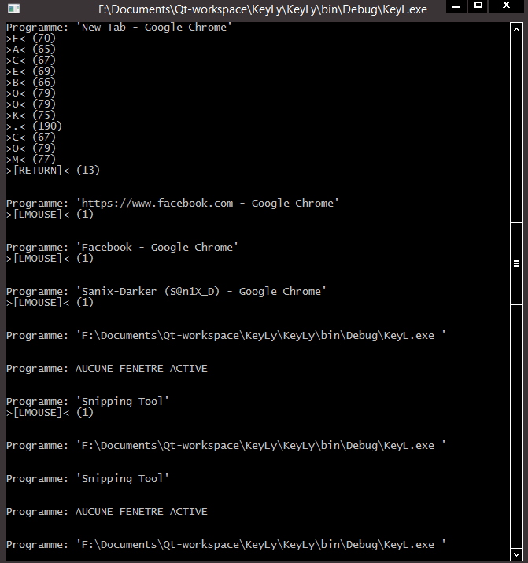
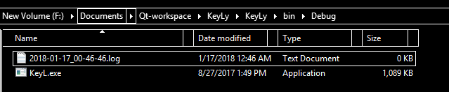
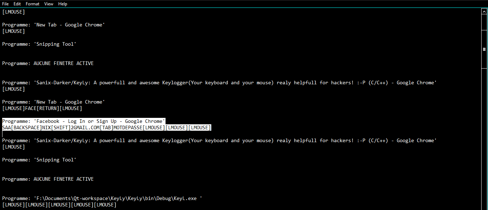

<h2>KeyLy</h2>
#A powerfull and awesome Keylogger(Your keyboard and your mouse) realy helpfull for hackers! :-P
<table style="width:100%;">
	<tr>
		<td> Source code on Code blocs</td>
		<td>  KeyLy collecting informations</td>
	</tr>
	<tr>
		<td>  The directory where Keyly save logs</td>
		<td>  Keyly capture an <b>"email"</b> and a <b>"password"</b> from facebook's target</td>
	</tr>
</table>
